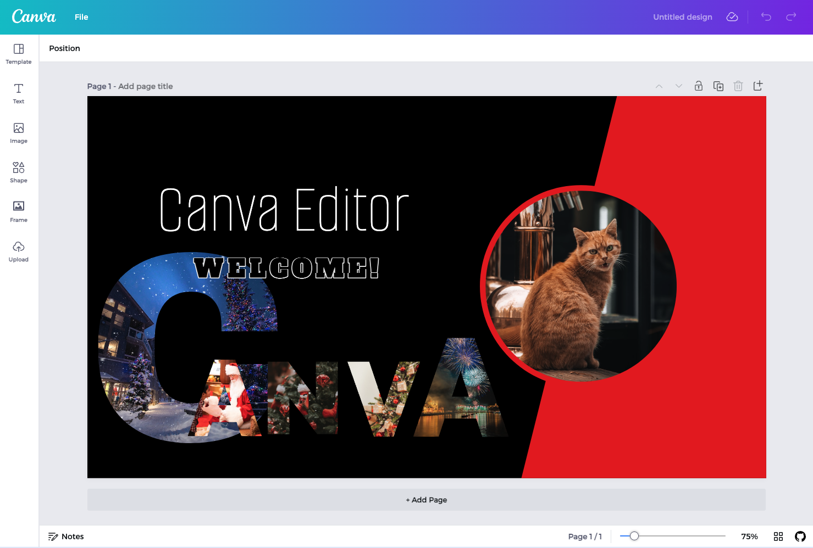

# Canva Clone

> **Status: Active Development** — core features are working but the project is not yet stable. APIs and interfaces may change. We are actively looking for contributors to help shape v1.



**Fork it, shape it, make it yours.**

An open-source foundation for building your own online graphic design tool. This monorepo gives you a working canvas editor, a Next.js frontend, a CMS-backed admin panel, and a mock API — so you can skip starting from scratch and focus on what makes your product unique.

- **Homepage:** [canvaclone.com](https://www.canvaclone.com/)
- **Docs:** [canvaclone.com/docs](https://www.canvaclone.com/docs)
- **License:** [MIT with No Resale Clause](./LICENSE.md)

---

## What's inside

| Package | Description |
|---|---|
| `apps/canva-web` | Next.js 16 frontend — templates, projects, auth, i18n |
| `apps/canva-admin` | Strapi CMS backend — templates, assets, users |
| `apps/mock-api` | Express mock API for local development without a real backend |
| `apps/canva-web-e2e` | Playwright end-to-end test suite |
| `apps/i18n` | Internationalisation string management |
| `libs/canva-editor` | Core React canvas editor (shapes, text, images, layers) |

**Stack:** React 19 · Next.js 16 · TypeScript · Tailwind CSS · Drizzle ORM · PostgreSQL · Better Auth · Zustand · Nx monorepo · pnpm

---

## Getting started

### Prerequisites

- Node.js 20.x
- pnpm (`npm install -g pnpm`)
- PostgreSQL 15+

### Install

```bash
git clone https://github.com/<your-username>/canva-clone.git
cd canva-clone
pnpm install
```

### Configure environment

```bash
cp apps/canva-web/.env.example apps/canva-web/.env
# Fill in your DB connection string, auth secrets, and storage config
```

### Run

```bash
make web_up       # Next.js frontend on localhost:3000
make admin_up     # Strapi admin on localhost:1337
make mock_up      # Mock API on localhost:3001
make editor_up    # Canvas editor in watch mode
```

See [CONTRIBUTING.md](./CONTRIBUTING.md) for the full setup guide, including database restore and all available commands.

---

## Project status

This project is under active development. Here is a rough picture of where things stand:

| Area | Status |
|---|---|
| Canvas editor (shapes, text, images) | Working |
| Template browsing & rendering | Working |
| User authentication | Working |
| Project save / load | Working |
| Internationalisation | Working |
| Export (PNG / PDF) | In progress |
| Real-time collaboration | Planned |
| Plugin / extension system | Planned |
| Comprehensive test coverage | Needs help |
| Full documentation | Needs help |

Anything marked **In progress** or **Planned** is a great place to contribute.

---

## Contributing

**We need your help.** This project is most useful when it has many contributors improving it together.

Whether you want to fix a bug, add a feature, improve documentation, or just report an issue — all contributions are welcome. Please read [CONTRIBUTING.md](./CONTRIBUTING.md) for guidelines on how to get set up and submit your first PR.

Not sure where to start? Look for issues labelled:

- [`good first issue`](../../issues?q=is%3Aissue+is%3Aopen+label%3A%22good+first+issue%22) — approachable tasks for newcomers
- [`help wanted`](../../issues?q=is%3Aissue+is%3Aopen+label%3A%22help+wanted%22) — areas where maintainers want outside input
- [`documentation`](../../issues?q=is%3Aissue+is%3Aopen+label%3Adocumentation) — docs improvements that do not require deep codebase knowledge

---

## Links

| Resource | URL |
|---|---|
| Homepage | https://www.canvaclone.com/ |
| Docs | https://www.canvaclone.com/docs |
| Contributing guide | [CONTRIBUTING.md](./CONTRIBUTING.md) |
| License | [LICENSE.md](./LICENSE.md) |
